# Introduction { .intro }

You are going to create a 2-player game to see who has the fastest reactions. The game will work by showing an image after a random amount of time - whoever presses their button first is the winner.

# Step 1: Wait for it! { .activity }

Let's start by displaying an image after a random amount of time.

## Activity Checklist { .check }

+ Go to <a href="http://jumpto.cc/mb-new" target="_blank">jumpto.cc/mb-new</a> to start a new project in the Code Kingdoms editor. Call your new project 'Reaction'.

+ Before displaying an image, the game should wait for a random amount of time.

Click the 'Control' tab, and drag a `wait` block into the `onstart()` event.

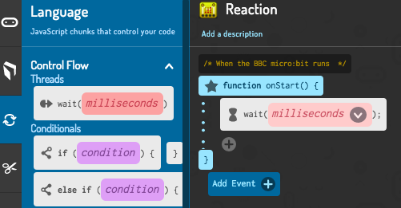

+ Click 'Library' and then 'Random', and drag the `number` block inside your `wait` block.

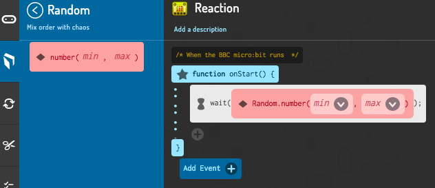

+ Choose a minimum and maximum time that your game should wait. Remember that 1000ms is 1 second, so 1000 and 5000 will wait between 1 and 5 seconds.

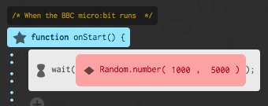

+ After waiting, your game should show an image so that players know when to press their button.

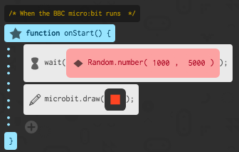

+ Click 'run' to test your project. You should see your image appear after a random delay.

## Challenge: Choose your own image { .challenge }
Can you change the image that's displayed?

# Step 2: Multiple rounds { .activity }

So far your players can only play once. Let's fix that!

## Activity Checklist { .check }

+ Click the 'Control' tab, and drag a `while` loop to the start of your code.

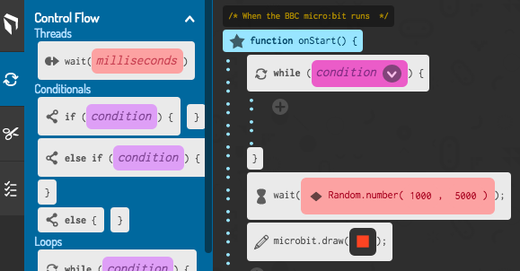

+ Click `test` inside your `while` loop, and choose `true` so that your game repeats forever.

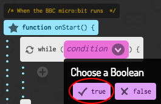

+ Drag your code for waiting and displaying an image inside your `while` loop.

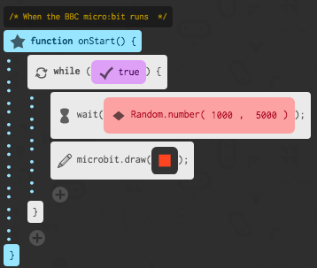

+ Add code at the end of your `while` loop to display your image for 1 second and then clear the display.

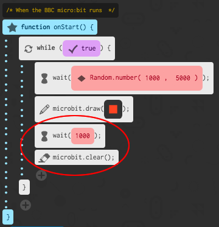

+ Test your project. You should see your image appear randomly and then disappear.

## Challenge: Choose your own delay { .challenge }
Change the numbers in your `random` block. You can speed up your game to make it harder, or slow it down to add suspense!

# Step 3: Waiting for a winner { .activity }

Let's add code to wait until a button is pressed.

## Activity Checklist { .check }

+ After displaying an image, you'll need to wait until someone presses their button.

Another way of saying this is that you'll need to wait as long as button A __and__ button B have __not__ been pressed.

To do this, add a `while` loop from the 'Control' section. The `while` loop should be added in just after the `draw` block.

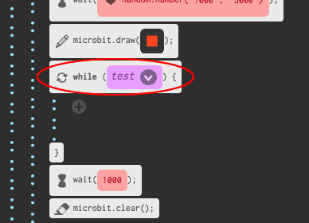

+ Click the arrow inside your `while` loop and choose `left && right` (`&&` means '__and__').

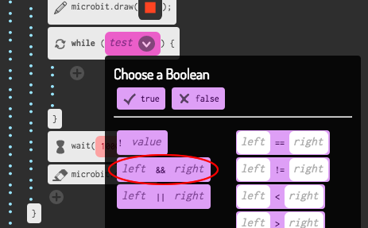

+ Click the arrow inside the `left` part of your `while` loop and `! value` (`!` means __not__).

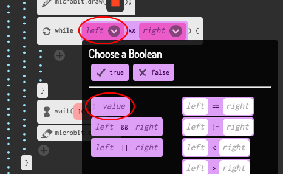

+ Click on the main code section, and drag a `buttonAPressed` block on top of the `value` part of your `while` loop.

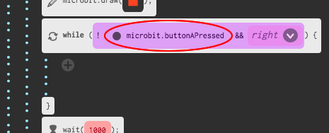

+ Repeat the 2 steps above to add `! button B` into the `right` side of your while loop.

+ You can then add a very short (20ms) delay, so that your `while` loop waits as long as a button hasn't been pressed.

+ Test your project. Your game should now display an image and then wait as long as buttons A __and__ B have __not__ been pressed.

# Step 4: Who is the fastest? { .activity }

Let's find out who pressed their button first.

## Activity Checklist { .check }

+ If button A was pressed, we want to point to player A. To do this, add an `if` block after your `while` loop, and replace `test` with `buttonAPressed`.

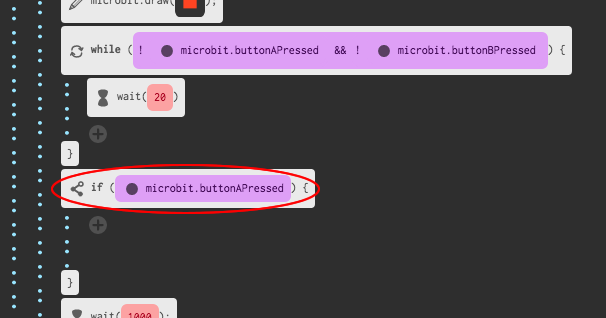

+ You can then use the `draw` block to show an arrow pointing to player A.

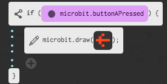

+ You should also do the same for button B.

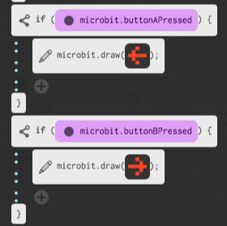

## Challenge: Keep score { .challenge }
Can you use two variables called `playerA` and `playerB` to keep track of each player's score?

You'll need to set both scores to 0 at the start of the game, and add 1 to whichever player wins each round.
